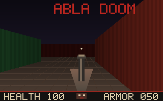

# Abla Doom

Abla Doom is a small original 2.5D raycasting homage built entirely in
[Abla](https://github.com/AndreBaltazar8/ablac) on
[Abla Graphics](https://github.com/AndreBaltazar8/abla-graphics). It contains
no original DOOM data, art, maps, sounds, or code. The map, palette, HUD, glyphs,
raycaster, input, and framebuffer are original procedural Abla code.



The renderer writes a reusable 320x200 affine RGBA8 `PixelBuffer`; Abla Graphics
presents the same frame through either a persistent OpenGL texture/full-screen
`$glsl` program or a Vulkan staging-buffer/image-copy path. Window creation and
events use the direct Abla X11 protocol implementation. There is no C/C++/Rust
implementation source, GLFW, SDL, or native project shim.

## Run

Check out `ablac`, `abla-graphics`, and `abla-doom` as sibling directories, then:

```sh
nix-shell --run 'make test'
nix-shell --run 'make build && ./build/abla-doom'
```

Use W/S to move, A/D or the arrow keys to turn, and Escape to quit. Automatic
selection prefers Vulkan and falls back to OpenGL; the smoke suite renders and
presents the procedural scene through both explicit backends.

Regenerate the clean 320x200 proof screenshot from a real software-rendered run:

```sh
nix-shell --run 'make screenshot'
```

## License

Abla Doom is released under the MIT License. “DOOM” is a trademark of its
respective owner; this independent project is not affiliated with or endorsed
by id Software or ZeniMax Media.
